# Team Pulse Showcase

## What Team Pulse Is

Team Pulse is a lightweight team intelligence system that turns noisy GitHub activity into a structured, explainable operating view for engineering leads.

Instead of asking every person for status in meetings, Team Pulse:

- ingests daily GitHub activity from one or more repositories,
- stores the raw snapshots as auditable markdown,
- compiles those snapshots into a living wiki of contributors, projects, patterns, and connections,
- generates decision-ready reports such as morning briefings, end-of-day summaries, and team dashboards,
- exposes everything through a web app with an AI chat interface.

The core idea is simple:

> capture raw operational data once, convert it into reusable knowledge, then generate multiple views for different audiences.

## Why This Matters

Most teams already have the data, but it is scattered:

- PRs and issues live in GitHub
- context lives in people's heads
- stand-up status is repetitive and manual
- patterns like burnout, review bottlenecks, or blocked contributors are visible only in hindsight

Team Pulse creates a shared operational memory layer on top of engineering activity.

That gives a team:

- a raw source of truth,
- a curated knowledge base,
- report generation on demand,
- and a conversational interface for follow-up questions.

## End-to-End Architecture

```mermaid
flowchart LR
    GitHub[GitHub Repos]
    Ingest["scripts/team_pulse.py"]
    Raw["raw/github-daily/*.md"]
    Compile["scripts/compile.py"]
    Wiki["wiki/ contributors projects patterns connections index log"]
    Reports["scripts/generate_report.py"]
    ReportFiles["wiki/reports/*.md"]
    AskServer["scripts/ask_server.py"]
    Outputs["outputs/*.md and outputs/.sessions/*.json"]
    Web["Next.js web app"]
    Chat["AI chat and report viewer"]

    GitHub -->|"gh api"| Ingest
    Ingest --> Raw
    Raw --> Compile
    Compile --> Wiki
    Raw --> Reports
    Wiki --> Reports
    Reports --> ReportFiles
    Wiki --> AskServer
    ReportFiles --> AskServer
    AskServer --> Outputs
    Wiki --> Web
    ReportFiles --> Web
    Web --> Chat
    Chat --> AskServer
```

## Layer 1: Raw Ingestion

The first layer is intentionally dumb and auditable.

[`scripts/team_pulse.py`](../scripts/team_pulse.py) uses the GitHub CLI (`gh api`) to pull daily activity for configured repositories and writes structured markdown snapshots into [`raw/github-daily/`](../raw/github-daily/).

Each snapshot contains:

- summary metrics,
- commits,
- PRs opened,
- PRs merged,
- open PRs with stuck detection,
- issues opened and closed,
- open issues,
- workload by assignee,
- contributor activity.

Example files:

- [`raw/github-daily/2026-04-16-am.md`](../raw/github-daily/2026-04-16-am.md)
- [`raw/github-daily/2026-04-16-pm.md`](../raw/github-daily/2026-04-16-pm.md)

This is the "ledger" layer. It is useful because it is:

- deterministic,
- inspectable by humans,
- easy to diff in git,
- reusable by downstream AI jobs.

## Layer 2: Wiki Compilation

The second layer turns repeated observations into reusable knowledge.

[`scripts/compile.py`](../scripts/compile.py) reads new raw snapshots and uses the Claude Agent SDK to update the curated wiki in [`wiki/`](../wiki/).

This wiki is typed into categories:

- [`wiki/contributors/`](../wiki/contributors/)
- [`wiki/projects/`](../wiki/projects/)
- [`wiki/patterns/`](../wiki/patterns/)
- [`wiki/connections/`](../wiki/connections/)
- [`wiki/index.md`](../wiki/index.md)
- [`wiki/log.md`](../wiki/log.md)

This is where Team Pulse becomes more than a reporting script.

Instead of just listing events, it synthesizes durable operational knowledge:

- contributor profiles such as [`wiki/contributors/garrytan.md`](../wiki/contributors/garrytan.md)
- project-level health summaries such as [`wiki/projects/gstack.md`](../wiki/projects/gstack.md)
- cross-cutting patterns such as [`wiki/patterns/burnout-signals.md`](../wiki/patterns/burnout-signals.md)
- relationship analysis such as [`wiki/connections/sole-maintainer-and-stuck-growth.md`](../wiki/connections/sole-maintainer-and-stuck-growth.md)

This layer is the memory system.

It lets later reports and chat answers build on accumulated context instead of re-deriving everything from raw data every time.

## Layer 3: Report Generation

The third layer generates audience-specific outputs from the raw data plus the curated wiki.

[`scripts/generate_report.py`](../scripts/generate_report.py) produces:

- morning briefings,
- end-of-day summaries,
- team dashboards.

Those reports are saved under [`wiki/reports/`](../wiki/reports/).

Examples:

- [`wiki/reports/2026-04-16-morning-briefing.md`](../wiki/reports/2026-04-16-morning-briefing.md)
- [`wiki/reports/2026-04-16-eod-summary.md`](../wiki/reports/2026-04-16-eod-summary.md)
- [`wiki/reports/2026-04-16-team-dashboard.md`](../wiki/reports/2026-04-16-team-dashboard.md)

This gives different views for different moments:

- Morning briefing: what needs attention today
- EOD summary: what changed during the day
- Team dashboard: leadership view across velocity, stuck work, review responsiveness, and burnout risk

In practice, this means the same source system can support:

- individual contributors,
- tech leads,
- engineering managers,
- and executive reviews.

## Layer 4: Web App and AI Interface

The final layer makes the system usable by non-technical stakeholders.

The web frontend lives in [`web/`](../web/) and is a Next.js app with:

- a sidebar for reports and wiki browsing,
- markdown-based report rendering,
- an AI chat interface for questions about the team.

Key pieces:

- [`web/src/app/layout.tsx`](../web/src/app/layout.tsx) loads wiki and report metadata
- [`web/src/components/sidebar.tsx`](../web/src/components/sidebar.tsx) exposes reports, archive, contributors, projects, patterns, and connections
- [`web/src/app/reports/[date]/[type]/page.tsx`](../web/src/app/reports/%5Bdate%5D/%5Btype%5D/page.tsx) renders report files
- [`web/src/components/chat.tsx`](../web/src/components/chat.tsx) provides the chat experience
- [`web/src/app/api/ask/route.ts`](../web/src/app/api/ask/route.ts) handles the frontend ask API
- [`scripts/ask_server.py`](../scripts/ask_server.py) runs the streaming AI backend

The AI layer can answer questions in two ways:

1. Fast path for known or cached questions
2. Full ask-server workflow for deeper synthesis over the wiki and reports

That means users can both browse fixed artifacts and ask follow-up questions like:

- Who is overloaded this week?
- Which contributors are blocked on review?
- Compare gstack and autoresearch health
- What changed since this morning?

## What Makes the Design Strong

This architecture works well because each layer has a clear job:

- Raw layer preserves evidence
- Wiki layer accumulates memory
- Report layer creates role-specific summaries
- Web layer makes the system accessible

That separation gives three important advantages:

### 1. Explainability

Every report can be traced back to raw snapshots and wiki sources.

### 2. Reuse

The same raw data powers multiple outputs without re-ingestion.

### 3. Scale

As the number of repositories, contributors, and stakeholders grows, the system can add more views without redesigning the pipeline.

## Example Operating Model

Today the workflow already looks like this:

1. Run ingestion twice per day to capture AM and PM snapshots.
2. Compile new snapshots into the wiki.
3. Generate reports for leadership and team use.
4. Ask follow-up questions in the web app.

This creates a daily operating rhythm:

- AM: identify priorities and blockers
- During the day: use the chat interface for situational questions
- PM: summarize progress and carry-over
- Over time: detect patterns the team would otherwise miss

## How This Scales

The current repo demonstrates the concept on a small set of repositories, but the design can scale in several directions.

### More Repositories

Expand [`TEAM_PULSE_REPOS`](../.env.example) to ingest additional teams or products.

### More Teams

Partition by org, department, or product area while keeping the same raw -> wiki -> report pipeline.

### More Signal Sources

Add inputs beyond GitHub over time, such as:

- incident systems,
- deploy logs,
- CI failures,
- issue trackers,
- calendar or planning systems.

### More Automation

Run the pipeline on a schedule and add alerts for:

- stuck work crossing thresholds,
- burnout indicators,
- zero-review windows,
- unusual drops in contribution activity.

### More Consumption Modes

Use the same knowledge layer for:

- team stand-ups,
- weekly leadership reviews,
- onboarding context,
- retrospectives,
- program management dashboards.

## Recommended Next Step

If the goal is to take Team Pulse from demo to platform, the next milestone is:

**make the pipeline multi-team, scheduled, and alert-driven while preserving the same transparent raw-to-report architecture.**

That means keeping the current strengths:

- markdown artifacts,
- explainable AI synthesis,
- repo-native storage,
- and a conversational UI,

while adding:

- scheduling,
- team segmentation,
- permissions,
- and notification workflows.

## One-Sentence Summary

Team Pulse is an AI-native operating layer for engineering teams: it ingests activity, builds memory, generates reports, and turns team health into something leaders can inspect, ask about, and scale.
